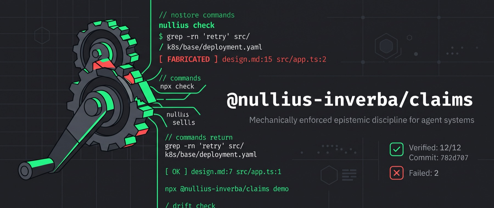

<p align="center">
  
</p>

# nullius

**Epistemic discipline for agent systems — mechanically enforced.**

[](https://github.com/armanfatemi/nullius/actions/workflows/ci.yml)
[](https://www.npmjs.com/package/@nullius-inverba/claims)
[](LICENSE)
[](#roadmap)

> [!NOTE]
> **This project is a work in progress.** The conventions here are in daily
> use by the pipeline they came from, and still moving. Both releases so far
> carried breaking changes — read
> [the changelog](CHANGELOG.md) before upgrading. Issues and pushback welcome.

_Nullius in verba_ — "take nobody's word for it." An agent's claim about your
code is not knowledge, it is text. This repo turns that text into something a
machine can refuse.

A document claims something about your code:

```markdown
**Evidence:** `k8s/base/settings/deployment.yaml:12` — `  replicas: 2`
```

The checker opens the file and re-verifies it. When the claim is wrong:

```
FABRICATED  design.md:15  src/app.ts:2
          ! text does not appear anywhere in src/app.ts
```

## Why

Agents state things about your codebase constantly — in plans, PR
descriptions, design docs: "nothing else consumes this event", "the helper
for X doesn't exist yet", "this enum is `@shareable`". Some of those claims
are wrong, and in multi-step, multi-agent development the wrongness is
invisible: every later step reasons from the recorded claim rather than the
code, and every reviewer — human or LLM — checks whether the _plan_ is good,
not whether its _premises_ are true. **A false premise that supports a
correct conclusion is invisible to every reviewer who agrees with the
conclusion.** We watched exactly that pass three review gates in the
pipeline this tool was extracted from — the incident is told in
[the spec](spec/evidence-anchors.md). The fix is not a smarter reviewer. It
is a citation convention (**Evidence Anchors**) plus a deterministic checker
that re-executes every citation, forever.

## Try it in ten seconds

```sh
npx @nullius-inverba/claims demo    # unscoped alias: npx evidence-anchors demo
```

This builds a sandbox doc plus a sandbox source file and checks one claim per
verdict class:

```
OK            design.md:7  src/app.ts:1
DRIFT         design.md:11  src/app.ts:3
              ~ text is on line 1, not 3 — update the citation
FABRICATED    design.md:15  src/app.ts:2
              ! text does not appear anywhere in src/app.ts
WEAK-ANCHOR   design.md:20  src/app.ts:1
              ~ quote is 1 character(s) — quote enough of src/app.ts to be wrong if the code changes
WRONG-LINE    design.md:25  src/app.ts:5
              ~ text is on line 1, not 5 — the quote still identifies real code, so this is stale rather than wrong; update the citation
UNPINNED      design.md:30  src/app.ts:5
              ! quote matches several lines in src/app.ts and is on none of them at line 5 — neither half of this citation identifies anything
SEARCH-CLEAN  design.md:34  grep -rn 'MAX_RETRIES' src/ → 1
COUNT-MISMATCH design.md:38  grep -rn 'retry' src/ → 0
              ! claimed 0, actual 1
UNSAFE        design.md:42  grep -rn 'x' src/ && rm -rf / → 0
              ! not executed — contains forbidden character '&'
OK            design.md:46  binds at rollout-window
UNKNOWN-MOMENT design.md:47  binds at partial-composition
              ! 'partial-composition' is not a binding moment; use one of: build-time, rollout-window, inter-service-skew, event-consumption, replay-migration, data-at-rest
STALE         design.md:52  src/legacy.ts:1@782d707
              ~ verified at 782d707; that text is no longer in src/legacy.ts — the code moved on, so re-read it before relying on this claim
FABRICATED    design.md:57  src/legacy.ts:1@782d707
              ! text does not appear anywhere in src/legacy.ts as of 782d707 — that commit is immutable, so no later edit can explain this
```

Those last two are the same file, the same commit, and the same refactor
since — with opposite verdicts. That is the point of stamping the commit you
read (`src/app.ts:12@a1b2c3d`): the claim about the **author** is settled
against an immutable commit and fails forever, while the claim about the
**repository** is advisory forever. A document cannot be turned red by someone
else's refactor, and a fabrication cannot be excused by one.

Stamped anchors need the history they name, so check out with `fetch-depth: 0`.
A commit this clone does not have is never held against the author: the verdict
fails open as the advisory `UNVERIFIABLE-REV`, with the remedy in the message.

That `UNSAFE` line is the security model working: checked documents are
untrusted input, so absence searches are parsed into an argv vector and spawned
without a shell, against a per-binary flag allowlist, and every cited path — in
both the presence and the absence lane — is validated before any file is read.

## Where the value comes from

Mostly from a moment the checker never sees: **to write a citation that will
survive the checker, the agent has to open the file** — so fabrication dies
at authoring time, before any reviewer reads a word. This is not a prompt
trick. An instruction to "verify your claims" decays like every instruction;
what makes this one hold is that skipping it now produces a deterministic
`FABRICATED` verdict on the record instead of a private shortcut. The checker
is the ratchet; the authoring behavior is the product.

Verification has a sibling problem the checker cannot solve alone:
**coverage**. An agent can anchor three easy truths and leave the
load-bearing claim bare. Three layers handle it: `check` reports **anchor
density** — every document's anchor count against its length, with
zero-anchor documents listed by name — so a 900-line plan with no checkable
claims is visible at a glance (the checker never judges how many is enough;
it makes the number legible, and `--require-markers` sets the floor at one).
The [`[false-premise]` reviewer severity](plugin/reviewers/false-premise.md)
catches bare-prose claims the anchors missed. And [eager mode](#if-you-just-ask-the-agent-to-do-things)
retrofits documents that were never anchored at all.

## Three verbs

| Verb      | The question it answers      | How                                |
| --------- | ---------------------------- | ---------------------------------- |
| `check`   | Did the author look?         | Deterministic — it opens the file  |
| `audit`   | Is the claim true?           | A model proposes, `check` disposes |
| `witness` | Did the checking happen?     | Deterministic — a run's own journal, validated |

`check` is the gate and it certifies **form**: the text is at the cited
location. It deliberately never certifies **entailment** — a real line, quoted
accurately, under a sentence it does not support, passes. `audit` is that
second half: each claim is dispatched to its own agent, alone, with no title,
no surrounding paragraph and no sibling claims, and told to **refute** it.
Claims presented together imply a narrative and a model handed a narrative
argues for it; one starved sentence has nothing to be loyal to. Refutations
come back as anchors, so `check` re-verifies them — no model is ever in the
verification path. And `witness` validates the journal a multi-agent run leaves
behind, because a run's own account of itself is exactly as trustworthy as a
design doc.

```sh
nullius audit design.md                  # the claims, one dispatch each
nullius audit design.md --emit-brief c1  # the starved brief for one claim
nullius witness validate run.jsonl       # did every dispatch actually terminate?
```

Anchors attach to **anything a human approves**. Pick your workflow — each
section stands alone.

## If you use plan mode (Claude Code)

**You get:** plans verified _before you hit approve_. An ephemeral plan is
still a document making load-bearing claims, and the person skimming it for
thirty seconds before approving is the most exposed reviewer there is.

```
/plugin marketplace add armanfatemi/nullius
/plugin install nullius@nullius
```

The plugin's `ExitPlanMode` hook checks every plan's anchors automatically
(fail-open — it never breaks plan mode), its authoring skill makes the agent
write anchors in the first place, and `/ground` checks any file on demand.
Details: [plugin/](plugin/).

## If your agents write PR descriptions, or you run agent reviews

**You get:** "safe — nothing else reads this field" in a PR body becomes a
checkable claim, and your reviewer agents gain a `[false-premise]` severity —
flag an uncited load-bearing claim even when the conclusion it supports still
looks right.

```yaml
# .github/workflows/claims.yml
on: pull_request
permissions: { contents: read, pull-requests: write }
jobs:
  claims:
    runs-on: ubuntu-latest
    steps:
      - uses: actions/checkout@v4
        with:
          fetch-depth: 0 # `git show <rev>:<path>` needs the commit an anchor names
      - uses: armanfatemi/nullius/action@main
        with:
          github-token: ${{ secrets.GITHUB_TOKEN }}
```

Zero further config: `pr-body` defaults to true, so this already checks the
PR description itself — advisory-only (it comments; it never blocks until you
set `strict`). The paste-ready reviewer severity:
[plugin/reviewers/false-premise.md](plugin/reviewers/false-premise.md).

## If you have a spec or RFC culture (OpenSpec, spec-kit, ADRs)

**You get:** the full discipline. Fabricated premises die at authoring time —
to write the citation the agent must open the file, and opening the file is
what kills the fabrication — and CI becomes a permanent drift alarm for every
doc.

1. Paste the [authoring skill](plugin/skills/evidence-anchors/SKILL.md) into
   your agents' instructions — it is plain markdown and works in CLAUDE.md,
   AGENTS.md, or Cursor rules.
2. Check locally, from the repo root:
   ```sh
   npx @nullius-inverba/claims check "docs/rfcs/**/*.md"
   ```
3. Gate in CI: the Action above with `globs: "docs/rfcs/**/*.md"` and
   `require-markers: true` — a proposal with no anchors at all is not a pass.
   The floor is per document, so one anchored file cannot license the rest.

Custom binding-moment vocabulary, drift window, and excludes live in
`nullius.config.json`: [packages/claims/](packages/claims/).

## If you just ask the agent to do things

**You get:** a retrofit lane — no doc culture required. Point `audit --propose`
at any existing document; the model hunts evidence in your code, and the
checker verifies whatever it proposes. The model proposes; the checker
disposes. (`--propose` is the confirmation-shaped mode — it is what
retrofitting needs, and it is a peer of the refute-first default rather than
the main road, because a model sent to find support will find it.)

```sh
claude -p "$(npx @nullius-inverba/claims audit design.md --propose)"
```

or `/audit <doc>` with the plugin installed. REFUTED claims come back with
counter-evidence; SUPPORTED claims get proposed anchors — yours to adopt, and
adopting them is the entailment review; everything else moves to
"Open questions". Your PR descriptions are already covered by the Action
above.

## This README is checked by the tool

The claims below are live anchors — CI runs `nullius check` on this file with
`--require-markers`, so the green badge above attests this README's own
claims about the code. The default binding-moment vocabulary is defined here:

**Evidence:** `packages/claims/src/checkClaims.ts:15@7412847` — `export const DEFAULT_BINDING_MOMENTS = [`

Path traversal is rejected before any file is read:

**Evidence:** `packages/claims/src/pathSafety.ts:39@7412847` — `return { safe: false, reason: "path traversal ('..') is not allowed" };`

And the checker makes no network calls:

**Evidence:** `grep -rn --include='*.ts' 'node:https' packages/claims/src/` → 0 results

## Why not transclusion?

Tools already exist that pull real source into a document — `embedme`, Sphinx
`literalinclude`, mdBook `{{#include}}`. They keep the snippet in sync
automatically. Why write the citation by hand?

**Because a transcluded snippet is true by construction, and that is exactly
why it proves nothing.** The build step guarantees the text matches the file.
It guarantees nothing about whether anyone read it — a generated snippet
attests that a build ran. An Evidence Anchor is written by the author and can
therefore be **wrong**, which is what makes writing one require opening the
file. Falsifiability is the product.

So the two compose rather than compete: **transclude for documentation, anchor
for claims.**

| Approach | Drift-proof? | Catches fabrication? | Machine-re-checkable? |
| --- | --- | --- | --- |
| Prose claim | — | ❌ | ❌ |
| Transclusion (`embedme`, `literalinclude`) | ✅ | ❌ — generated text cannot be wrong | ✅ |
| GitHub permalink | ✅ | ❌ — nobody clicks it | ❌ |
| Link checker | — | ❌ — existence, not content | ✅ |
| Doctest | ✅ | ❌ — behaviour, not the claim | ✅ |
| **Evidence Anchor** | via `@rev` + `STALE` | ✅ | ✅ |

"A falsifiable, machine-re-checkable assertion about code" is the empty cell.
Which makes the modest description the accurate one, and it is worth saying
plainly: this is a linter for a citation format. The epistemics are why the
format is shaped this way; the linter is what you install.

## What's here

| Piece                                             | What it is                                                                                                           |
| ------------------------------------------------- | -------------------------------------------------------------------------------------------------------------------- |
| [Evidence Anchors spec](spec/evidence-anchors.md) | The authoring convention: load-bearing claims about existing code carry a re-verifiable citation                     |
| [Binding Moments spec](spec/binding-moments.md)   | The companion for compatibility risks: name _when_ the risk binds, from a closed per-project vocabulary              |
| [`@nullius-inverba/claims`](packages/claims/)     | The CLI (`check` / `audit` / `witness` / `demo`) + library. `check` and `witness` open files and never ask a model |
| [GitHub Action](action/)                          | Advisory PR comments, `pr-body` mode, a hard gate when you opt in                                                    |
| [Claude Code plugin](plugin/)                     | Authoring skill, plan-approval hook, `/ground`, `/audit`, and the `[false-premise]` reviewer block                   |
| `witness validate`                                | The run-journal validator — three invariants, no model ([the schema](spec/witness-journal.md))                       |

## Design principles

1. **Deterministic over model-judged.** No model certifies truth anywhere in
   the loop — the checker opens the file. A verdict you can re-run is a
   verdict you can trust in CI.
2. **Verdicts certify form, never entailment.** A real-but-selectively-quoted
   line passes; whether the evidence supports the decision stays with
   reviewers. Advertised limits are the credibility.
3. **Untrusted input.** Checked documents are PR-controlled content: path
   guard before any read, grep/rg-only command sandbox, no chaining or
   redirection.
4. **Closed vocabularies.** An invented binding moment fails loudly instead
   of sliding through as plausible prose.
5. **Advisory first, facts only.** Report-only in CI until the team trusts
   the verdicts — and no anchors on judgment calls; citation theater trains
   readers to skim.

## Roadmap

- **`witness harvest`** — the other half of the retro kit: a bounded
  PR-evidence harvester plus the "bad witness" retro-agent conventions. The
  journal validator (`witness validate`) ships now; the harvester is held back
  until its conventions have more real-world mileage.
- **Stamping help** — `@rev` anchors are written by hand today. A
  `--stamp` pass that fills in the commit for anchors that verify against the
  working tree would remove the last piece of clerical work.
- Open threads: [`init`](https://github.com/armanfatemi/nullius/issues/1),
  [embedded `--eager`](https://github.com/armanfatemi/nullius/issues/6).

## Names

The repo and the CLI bin are **nullius**, the first word of the motto the
Royal Society chose in the 1660s — coined for eminent men asserting things
fluently while rooms of other eminent men nodded. The npm scope
[`@nullius-inverba`](https://www.npmjs.com/org/nullius-inverba) takes the
whole of it; [`evidence-anchors`](https://www.npmjs.com/package/evidence-anchors)
is the same checker under the name of the thing it checks. Extracted from a working
agent pipeline, where it gates every proposal before any reviewer reads it.

## License

MIT © Arman Fatemi
